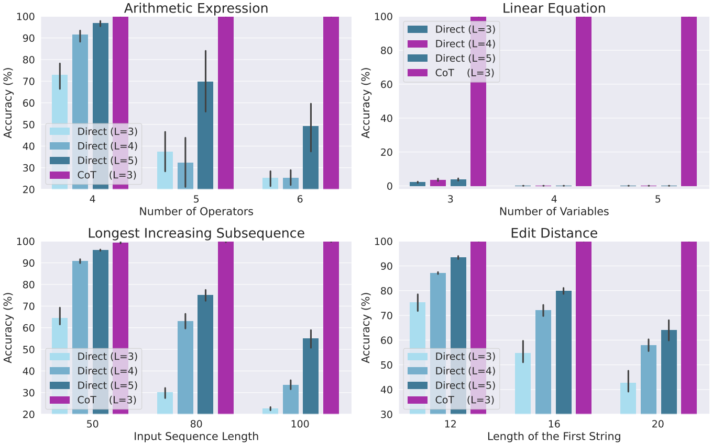

# Towards Revealing the Mystery behind Chain of Thought: a Theoretical Perspective
<p align="center">
  
</p>

This repository is the official implementation of [“Towards Revealing the Mystery behind Chain of Thought: a Theoretical Perspective”](https://arxiv.org/abs/2305.15408), based on the implementation of [minGPT](https://github.com/karpathy/minGPT) in [PyTorch](https://github.com/pytorch/pytorch).

```
@misc{feng2023revealing,
      title={Towards Revealing the Mystery behind Chain of Thought: a Theoretical Perspective}, 
      author={Guhao Feng and Bohang Zhang and Yuntian Gu and Haotian Ye and Di He and Liwei Wang},
      year={2023},
      eprint={2305.15408},
      archivePrefix={arXiv},
      primaryClass={cs.LG}
}
```

### Data Generation
The training and testing data can be generated via the command in [DATA.md](assets/DATA.md).

### Training
The training instruction is in [TRAIN.md](assets/TRAIN.md).

### Testing
The testing instruction is in [TEST.md](assets/TEST.md).

### License
This project is under the MIT license. See [LICENSE](LICENSE) for details.
